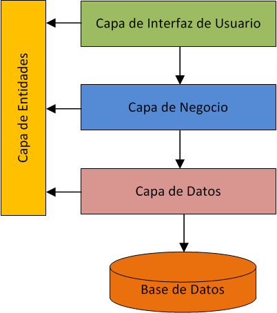

# Proyecto Zeit Backend



## Descripción del Proyecto

Este proyecto implementa una arquitectura en capas con cuatro capas principales:

- **Capa de Presentación**: Implementa la API REST usando ASP.NET Core.
- **Capa de Negocio**: Contiene la lógica de negocio.
- **Capa de Datos**: Se encarga de la persistencia en la base de datos utilizando Entity Framework Core.
- **Capa de Entidad**: Contiene los modelos de datos utilizados en el proyecto.

La aplicación está diseñada para interactuar con una base de datos **SQL Server**, y puede ser levantada utilizando **Docker**.

## Requisitos Previos

- **.NET 6 o superior**: Debes tener instalado el SDK de .NET.
- **Docker**: Necesitarás Docker para levantar una instancia de SQL Server en un contenedor.
- **Entity Framework Core**: Ya está incluido en el proyecto, pero debes restaurar las dependencias.

## Instalación

### 1. Restaurar Dependencias

Navega a la carpeta raíz del proyecto y ejecuta:

```bash
dotnet restore
```

### 2. Configuración de la Base de Datos (SQL Server en Docker)

Para levantar una instancia de **SQL Server** utilizando Docker, ejecuta el siguiente comando:

```bash
docker run --name sqlserver-zeit -e "ACCEPT_EULA=Y" -e "SA_PASSWORD=TuPasswordSegura123!" -p 1433:1433 -d mcr.microsoft.com/mssql/server:2019-latest
```

Esto levantará una instancia de SQL Server en el puerto `1433` con la contraseña `TuPasswordSegura123!`.

### 3. Configuración de la Cadena de Conexión

Asegúrate de que la cadena de conexión a la base de datos en el archivo `appsettings.json` (dentro de **CapaDePresentacion**) apunte a la instancia de SQL Server que has levantado con Docker.

```json
{
  "ConnectionStrings": {
    "DefaultConnection": "Server=localhost,1433;Database=zeit_db;User Id=sa;Password=TuPasswordSegura123!;"
  }
}
```

### 4. Levantar el Proyecto

Ahora puedes levantar el proyecto. Navega a la carpeta **CapaDePresentacion** y ejecuta:

```bash
dotnet run
```

La aplicación estará disponible en `http://localhost:5000` o `https://localhost:5001`.

## Acceder a la API

La aplicación incluye **Swagger** para explorar y probar los endpoints de la API. Puedes acceder al **Swagger UI** en:

```
http://localhost:5000/swagger
```

## Uso de Swagger

- En **Swagger**, puedes interactuar con los endpoints de la API.
- Los endpoints incluyen operaciones CRUD sobre entidades como `Todo` y autenticación.

## Proyecto en Capas

El proyecto sigue una arquitectura en capas como se describe a continuación:

1. **Capa de Presentación**: Es la capa de interacción con el cliente. Aquí se implementan los controladores que exponen los endpoints de la API REST.
2. **Capa de Negocio**: Contiene la lógica de negocio. Se encarga de procesar los datos antes de interactuar con la capa de datos o devolver la respuesta a la capa de presentación.
3. **Capa de Datos**: Implementa la persistencia utilizando **Entity Framework Core** para interactuar con la base de datos.
4. **Capa de Entidad**: Define los modelos de datos que son utilizados en las otras capas.

docker run --name postgresdb -e POSTGRES_USER=postgres -e POSTGRES_PASSWORD=TuPasswordSegura123 -e POSTGRES_DB=zeit_db -p 5432:5432 -d postgres
"Host=localhost;Port=5432;Database=zeit_db;Username=postgres;Password=TuPasswordSegura123;"